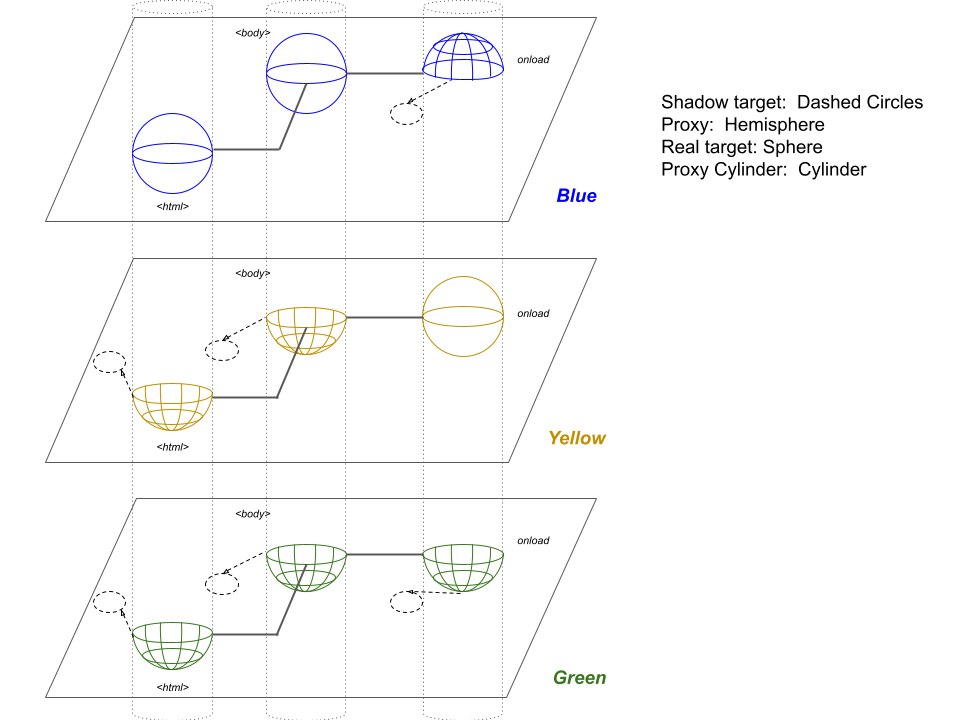

# Proxy Revocation By Controllers

## Status

- Champion(s): Mark S. Miller, Jack Works (all credit goes to Alex and Bradley)
- Author(s): Alexander J. Vincent, Bradley Farias
- Stage: 0

## Motivation

Membranes, which use Proxy and WeakMap to separate one object graph (think "Realm") from others, could have hundreds or thousands of proxies in each object graph.  In revoking an object graph, a membrane must revoke all of these proxies at once, and all proxies in other object graphs to objects in that object graph.

We propose a RevocationController class, available via a static maker function on Proxy, and which developers can pass instances into Proxy.revocable via a third argument.  RevocationController draws inspiration directly from the Document Object Model's [AbortController](https://dom.spec.whatwg.org/#interface-abortcontroller).

## Use cases

### Membranes revoking entire object graphs

In April 2021, Mark Miller proposed an idea for Realms, [adding a .revoke() method](https://github.com/tc39/proposal-shadowrealm/issues/299).  The idea there is you could have all the proxies in a Realm revoked at once.  Everyone who’s responded generally thinks it’s a great idea, but not necessary for the MVP of Realms.

In the GitHub issue, Alex Vincent realized that this improvement didn’t go far enough.  Consider the following where each plane is a Realm, raw objects are spheres, proxies are hemispheres, and the vertical cylinders represent connections between proxies and their objects.  (This is a geometric model of a membrane.)

Figure 1



Yellow.revoke(), as Mark envisioned it, would directly kill the &lt;html&gt; and &lt;body&gt; proxies in the Yellow realm, but it wouldn’t directly kill the "onload" proxies in the Blue and Green realms.  These proxies would only find out when they tried to access the Yellow “onload” object and threw exceptions.  They’re dead and don’t know it.  The client code is responsible for handling these exceptions.

```javascript
const membrane = new Membrane;

const green = new ShadowRealm;
const yellow = new ShadowRealm;

yellow.car = new Car;

// Setting up the initial reference to yellow.car in the green realm:
membrane.bindProxyForObject(yellow, green, "car");

// In the membrane, this runs:
{
  const yellowGreenController = Proxy.revocationController(yellow, green);
  this.cacheRevokeController(yellowGreenController, [yellow, green]);

  const shadowTarget = {};
  const { proxy } = Proxy.revocable(shadowTarget, membraneProxyHandler, { signal: yellowGreenController.signal });

  green.car = proxy;

  this.bindOneToOne(yellow, yellow.car, green, proxy);
}

// In the green realm, this code runs.
green.car.driver = new Driver;

// In the membrane, this runs:
{
  const yellowGreenController = this.getRevokeController(yellow, green); // gets yellowGreenController from earlier

  const shadowTarget = {};
  const { proxy } = Proxy.revocable(shadowTarget, membraneProxyHandler, { signal: yellowGreenController.signal });
  yellow.car.driver = proxy;

  this.bindOneToOne(green, green.car.driver, yellow, proxy);
}

membrane.revoke(yellow);

// In the membrane, this runs:
{
  const controllers = this.getRevokeControllers(yellow); // returns [yellowGreenController]
  controllers.forEach(c => c.revoke());
  // this triggers yellowGreenController.signal, which knocks out green.car and yellow.car.driver
}
```

Note we are not specifying the membrane API here.  The methods for the membrane are only illustrative.

One particular benefit of this is returning revocation management (and thus, garbage collection of proxies) back to the JavaScript engine.  The need to explicitly generate a revoker function becomes obsolete, but for backwards compatibility, we'd preserve it.

### Memory optimizations

If we don't actually create a revoker function per proxy (possibly via `new Proxy` and the third argument), this means less memory allocation and less garbage collection pressure.

## Description

*Developer-friendly documentation for how to use the feature*

## Comparison

*A comparison across various related programming languages and/or libraries. If this is the first sort of language or library to do this thing, explain why that is the case. If this is a standard library feature, a comparison across the JavaScript ecosystem would be good; if it's a syntax feature, that might not be practical, and comparisons may be limited to other programming languages.*

There is prior art for passing AbortSignals across Realms.  See issue #1.

## Implementations

### Polyfill/transpiler implementations

*A JavaScript implementation of the proposal, ideally packaged in a way that enables easy, realistic experimentation. See [implement.md](https://github.com/tc39/how-we-work/blob/master/implement.md) for details on creating useful prototype implementations.*

### Native implementations

## Q&A

*Frequently asked questions, or questions you think might be asked. Issues on the issue tracker or questions from past reviews can be a good source for these.*

**Q**: Why does this need to be built-in, instead of being implemented in JavaScript?

**A**: (1) We want to hand actual management of the proxies back to the JavaScript engine.  Membranes storing hundreds of revokers and then revoking them synchronously is painful.  (2) We believe this design will work better for compartments.

**Q**: Why have a third argument?

**A**: We believe this is the simplest way to maintain backwards compatibility and add the feature we are requesting.  The alternative is defining another static maker function on Proxy, which we would prefer not to do.  We are also aware of the importance of shaping this third-argument API correctly up front.

**Q**: Should `new Proxy` get a third argument as well? (#6)

**A**: Maybe.  We're undecided on this.  In favor would be consistency.  Against would be that proxies created via `new Proxy` do not have a revocation mechanism.

**Q**: Consider an outer realm containing an inner realm, and the outer realm is revoked.  Does this trigger the RevocationController's signal for the inner realm?

**A**: To be determined.  We need to flesh out the example code for this case to see whether it really applies or not.  Most likely this involves the controller for the inner realm being held outside both realms.

### Out of Scope

#### Observing revocation

This proposal is tailored towards allowing creation of revocable groupings of Proxies, a general signaling mechanism has been the subject of debate at TC39 and we believe this proposal serves its own purpose without an observation mechanism. There is no clear reason why signaling could not be added to the proposed APIs here as a follow on. Adding signaling has a variety of concerns such as re-entrancy and compatibility with other host environment features.
